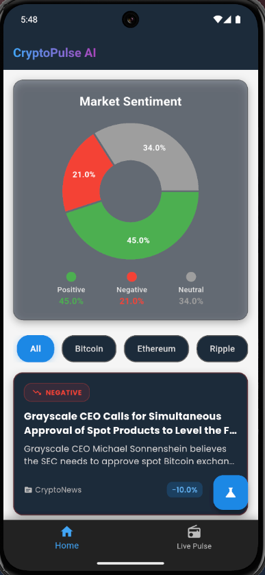
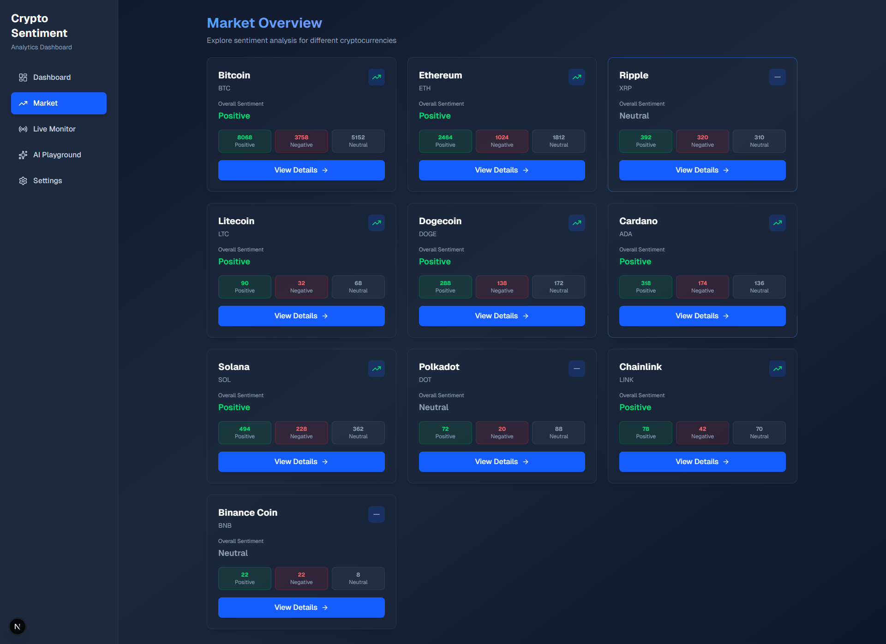
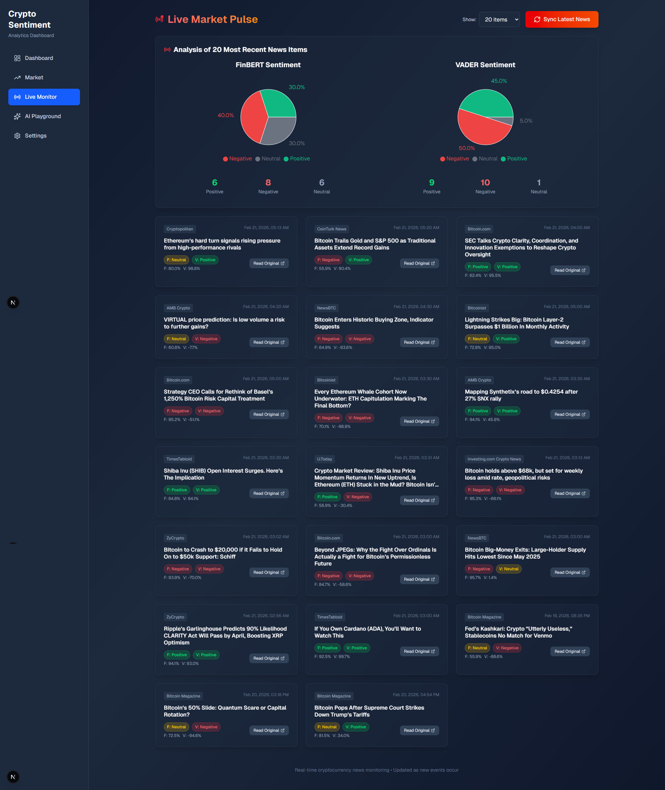
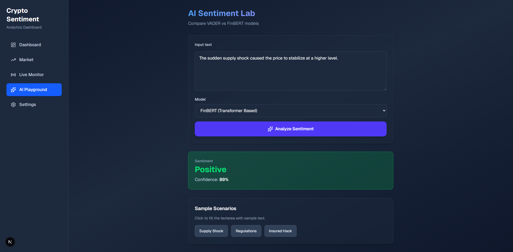
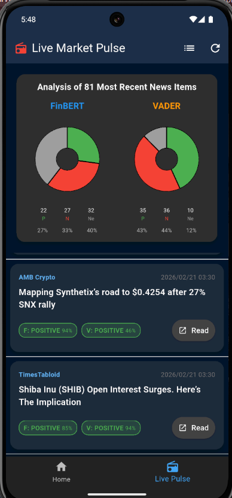
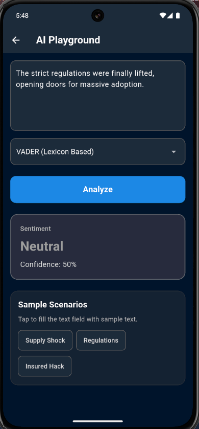

# 📊 CryptoSentiment-Core

**Real-time Cryptocurrency Sentiment Analysis Platform** - A comprehensive solution that analyzes cryptocurrency news sentiment using dual AI models (VADER & FinBERT) across mobile and web platforms.

[](https://nextjs.org/)
[](https://flutter.dev/)
[](https://fastapi.tiangolo.com/)
[](https://www.python.org/)
[](LICENSE)

## 🚀 Overview

CryptoSentiment-Core is a sophisticated platform that provides real-time sentiment analysis for cryptocurrency news using two cutting-edge AI models. The system aggregates news from multiple sources, processes content through VADER (rule-based) and FinBERT (transformer-based) models, and delivers actionable insights through both mobile and web interfaces.

### 🎯 Key Value Proposition

- **Dual AI Model Approach**: Leverage both speed and accuracy with VADER's fast processing and FinBERT's financial domain expertise
- **Cross-Platform Accessibility**: Access insights via mobile app (iOS/Android) or web dashboard
- **Real-time Analysis**: Live news monitoring with immediate sentiment processing
- **Multi-source Integration**: Aggregate data from leading cryptocurrency news sources
- **Professional Design**: Modern dark-themed interface with responsive design

## 🌟 Key Features

### 📱 Mobile Application (Flutter)


_The intuitive mobile interface showing real-time market sentiment_

- **Native Cross-Platform Experience**: Seamless iOS and Android support
- **Real-time Sentiment Feed**: Live news pulse with color-coded sentiment indicators
- **Offline Capability**: Core functionality available without constant internet connectivity
- **Intuitive Navigation**: Bottom navigation bar for quick access to different sections
- **Performance Optimized**: Efficient data handling and smooth user experience

### 🖥️ Web Dashboard (Next.js)


_Comprehensive dashboard with market overview and sentiment analysis_

#### Main Dashboard

- **Sentiment Visualization**: Interactive pie charts comparing positive, negative, and neutral sentiments
- **Real-time News Feed**: Curated cryptocurrency news with sentiment indicators
- **Multi-coin Support**: Analyze sentiment for Bitcoin, Ethereum, Ripple, and other major cryptocurrencies
- **Advanced Filtering**: Sort news by date, coin, sentiment, and source
- **Performance Metrics**: Historical sentiment trends and comparison analysis

#### Market Analysis Page


_Detailed sentiment analysis for various cryptocurrencies_

- **Per-coin Analysis**: Individual sentiment statistics for popular cryptocurrencies
- **Sentiment Comparison**: VADER vs FinBERT results for validation
- **Interactive Grid View**: Cards for each coin with clear visual indicators
- **Market Health Score**: Aggregate market sentiment across all cryptocurrencies

#### Live Monitor


_Real-time live market monitoring system_

- **Live News Feed**: Stream updates from major cryptocurrency sources
- **Live Processing**: Instant sentiment analysis using dual AI models
- **Model Comparison**: View how both VADER and FinBERT assess each piece of news
- **Sources Diversity**: Integrate feed from multiple platforms (Coindesk, CoinTelegraph, etc.)

#### AI Playground


_Interactive AI model testing environment_

- **Model Comparison**: Test both VADER and FinBERT on custom text
- **Real-time Results**: Instant sentiment analysis with confidence scores
- **Sample Scenarios**: Pre-loaded examples for quick testing
- **Educational Tool**: Understand how different models interpret sentiment

### 🤖 AI Models & Technology

#### VADER (Valence Aware Dictionary and sEntiment Reasoner)

- **Type**: Rule-based sentiment analyzer
- **Speed**: Fast processing (~2ms per article)
- **Strengths**: Excellent for real-time processing, handles social media text well
- **Use Case**: Primary model for live news monitoring
- **Implementation**: NLTK-based with cryptocurrency-specific lexicon adjustments

#### FinBERT (Financial BERT)

- **Type**: Transformer-based deep learning model
- **Accuracy**: High precision for financial domain text
- **Strengths**: Contextual understanding, handles complex financial terminology
- **Use Case**: Validation and detailed analysis of important news
- **Implementation**: Pre-trained ProsusAI/finbert model fine-tuned for financial sentiment

#### Hybrid Approach Benefits

- **Speed vs Accuracy**: VADER for quick processing, FinBERT for validation
- **Cross-verification**: Compare results for higher confidence
- **Redundancy**: System remains functional even if one model fails
- **Performance Optimization**: Use appropriate model for different use cases

## 🏗️ Technical Architecture

### System Overview

```
┌─────────────────┐    ┌─────────────────┐    ┌─────────────────┐
│   Mobile App    │    │  Web Dashboard  │    │   Data Sources  │
│   (Flutter)     │    │    (Next.js)    │    │ (RSS/API feeds) │
└─────────┬───────┘    └─────────┬───────┘    └─────────┬───────┘
          │                      │                      │
          └──────────────────────┼──────────────────────┘
                                 │
                    ┌─────────────────────┐
                    │   Backend API       │
                    │   (FastAPI/Python)  │
                    └─────────────────────┘
                                 │
                    ┌─────────────────────┐
                    │   Database Layer    │
                    │   (SQLite)          │
                    └─────────────────────┘
```

### Technology Stack

#### Backend (Python/FastAPI)

- **Framework**: FastAPI with Uvicorn ASGI server
- **Database**: SQLite with SQLAlchemy ORM
- **AI Libraries**:
  - `nltk` for VADER sentiment analysis
  - `transformers` for FinBERT model
  - `torch` for PyTorch deep learning
- **Data Sources**:
  - CryptoCompare API
  - NewsAPI.org
  - RSS feeds (CoinDesk, CoinTelegraph, CryptoNews, etc.)
- **Processing**: Concurrent news fetching and sentiment analysis

#### Web Frontend (Next.js)

- **Framework**: Next.js 16 with App Router
- **Language**: TypeScript
- **Styling**: Tailwind CSS with custom dark theme
- **Data Visualization**: Recharts for interactive charts
- **State Management**: React Context API
- **HTTP Client**: Axios for API communication

#### Mobile App (Flutter)

- **Framework**: Flutter 3.8+
- **Language**: Dart
- **State Management**: GetX pattern
- **UI Components**:
  - `fl_chart` for data visualization
  - `http` for API calls
  - `url_launcher` for external links
- **Design**: Material Design with custom dark theme

### Data Flow Architecture

#### Real-time Processing Pipeline

1. **News Aggregation**: Multiple RSS feeds and APIs
2. **Content Processing**: Text cleaning and preparation
3. **Dual Analysis**: Simultaneous VADER and FinBERT processing
4. **Result Storage**: Database with both model results
5. **API Distribution**: RESTful endpoints for client consumption
6. **Client Display**: Mobile and web interfaces

#### Database Schema

- **News Table**: Historical news articles with sentiment data
- **Live News Table**: Real-time news with dual model results
- **Sentiment Fields**: Separate columns for VADER and FinBERT results
- **Metadata**: Source, timestamp, URL, and processing information

## 🛠️ Installation & Setup

### Prerequisites

#### System Requirements

- **Python**: 3.8 or higher
- **Node.js**: 18 or higher
- **Flutter**: 3.8 or higher
- **Android Studio**: For mobile development (optional)
- **Git**: For version control

#### Backend Dependencies

```bash
# Python packages (automatically installed via requirements.txt)
fastapi
uvicorn
pandas
nltk
sqlalchemy
transformers
torch>=2.6
scipy
requests
feedparser
beautifulsoup4
lxml
```

### Quick Start Guide

#### 1. Backend Setup

```bash
# Navigate to backend directory
cd backend

# Install Python dependencies
pip install -r requirements.txt

# Start the FastAPI server
uvicorn main:app --reload

# Server will be available at http://127.0.0.1:8000
```

#### 2. Web Dashboard Setup

```bash
# Navigate to web dashboard directory
cd web_dashboard/crypto-dashboard

# Install Node.js dependencies
npm install

# Start development server
npm run dev

# Dashboard will be available at http://localhost:3000
```

#### 3. Mobile App Setup

```bash
# Navigate to mobile app directory
cd mobile_app/crypto_sentiment_app

# Install Flutter dependencies
flutter pub get

# Run on connected device or emulator
flutter run

# For web version (alternative)
flutter run -d chrome
```

### Configuration

#### Environment Variables

Create a `.env` file in the backend directory:

```env
# News API Configuration
NEWS_API_KEY=your_newsapi_key_here

# Database Configuration
DATABASE_URL=sqlite:///./crypto.db

# Server Configuration
HOST=127.0.0.1
PORT=8000
```

#### API Keys Setup

1. **NewsAPI**: Get free API key from [newsapi.org](https://newsapi.org/)
2. **CryptoCompare**: No API key required for basic usage
3. **RSS Feeds**: No configuration needed (public feeds)

#### Development vs Production

- **Development**: Use `--reload` flag for auto-restart
- **Production**: Use process managers like `gunicorn` or `pm2`
- **Database**: SQLite for development, PostgreSQL for production

## 📖 Usage Guide

### Web Dashboard Navigation

#### Main Dashboard

1. **Access**: Visit `http://localhost:3000`
2. **Features**:
   - Overall market sentiment visualization
   - Latest news feed with sentiment indicators
   - Coin-specific analysis (search by name)
   - Real-time data updates

#### Market Analysis

1. **Navigation**: Click "Market" in sidebar
2. **Features**:
   - Per-coin sentiment cards
   - Comparison between cryptocurrencies
   - Detailed statistics view
   - Quick navigation to detailed analysis

#### Live Monitor

1. **Navigation**: Click "Live Monitor" in sidebar
2. **Features**:
   - Real-time news feed
   - Live sentiment processing
   - Model comparison view
   - Manual sync capability
   - Adjustable news count

#### AI Playground

1. **Navigation**: Click "AI Playground" in sidebar
2. **Features**:
   - Text input for custom analysis
   - Model selection (VADER/FinBERT)
   - Real-time results with confidence scores
   - Sample scenarios for testing
   - Educational comparison tool

### Mobile App Usage

#### Home Screen

- **Overview**: Market sentiment summary
- **Quick Stats**: Positive/Negative/Neutral counts
- **Recent News**: Latest articles with sentiment
- **Navigation**: Bottom tab bar for sections

#### Live Pulse

- **Real-time Feed**: Streaming news updates
- **Sentiment Indicators**: Color-coded sentiment badges
- **Source Information**: News source attribution
- **External Links**: Tap to read full articles

#### Settings

- **Theme Toggle**: Dark/Light mode switch
- **AI Model Selection**: Choose default processing model
- **About Information**: Version and project details

### API Endpoints

#### Core Endpoints

```bash
# Get news articles
GET /api/news?skip=0&limit=50&q=Bitcoin

# Get sentiment statistics
GET /api/stats?q=Bitcoin

# Get live news
GET /api/live_news?limit=20

# Analyze text with specific model
POST /api/analyze_text
{
  "text": "Bitcoin price surges after positive regulatory news",
  "model": "vader"
}

# Re-analyze database with specific model
POST /api/reanalyze_db
{
  "model": "finbert",
  "limit": 100
}
```

#### Model-Specific Endpoints

```bash
# VADER statistics
GET /api/vader_stats?q=Bitcoin

# FinBERT statistics
GET /api/finbert_stats?q=Bitcoin

# Live VADER stats
GET /api/live_vader_stats

# Live FinBERT stats
GET /api/live_finbert_stats
```

## 📸 Screenshots & Visuals

### Mobile Application

<div style="display: flex; flex-wrap: wrap; gap: 20px;">
  <div style="flex: 1; min-width: 300px;">
    <h4>📱 Home Screen</h4>
    
    <p>Dashboard overview showing market sentiment and recent news</p>
  </div>
  
  <div style="flex: 1; min-width: 300px;">
    <h4>⚡ Live Market Pulse</h4>
    
    <p>Real-time news feed with dual sentiment analysis</p>
  </div>
  
  <div style="flex: 1; min-width: 300px;">
    <h4>🧪 AI Playground</h4>
    
    <p>Mobile interface for testing sentiment models</p>
  </div>
</div>

### Web Dashboard

<div style="display: flex; flex-wrap: wrap; gap: 20px;">
  <div style="flex: 1; min-width: 400px;">
    <h4>🖥️ Main Dashboard</h4>
    
    <p>Comprehensive market overview with sentiment visualization</p>
  </div>
  
  <div style="flex: 1; min-width: 400px;">
    <h4>📈 Market Analysis</h4>
    
    <p>Per-coin sentiment analysis with detailed statistics</p>
  </div>
  
  <div style="flex: 1; min-width: 400px;">
    <h4>📡 Live Monitor</h4>
    
    <p>Real-time news processing with model comparison</p>
  </div>
  
  <div style="flex: 1; min-width: 400px;">
    <h4>🔬 AI Playground</h4>
    
    <p>Interactive testing environment for sentiment models</p>
  </div>
</div>

## 🤝 Contributing

### Development Guidelines

#### Code Standards

- **Backend**: Follow PEP 8 Python standards
- **Frontend**: Use TypeScript with strict typing
- **Mobile**: Follow Flutter/Dart best practices
- **Documentation**: Keep README and code comments up to date

#### Branch Strategy

- **main**: Production-ready code
- **develop**: Active development branch
- **feature/branch-name**: New features
- **hotfix/branch-name**: Critical bug fixes

#### Pull Request Process

1. Fork the repository
2. Create feature branch from `develop`
3. Implement changes with proper testing
4. Update documentation if needed
5. Submit pull request to `develop` branch

### Testing Requirements

- **Backend**: Unit tests for API endpoints and AI models
- **Frontend**: Component tests and integration tests
- **Mobile**: Widget tests and integration tests
- **End-to-End**: Cross-platform functionality testing

### Reporting Issues

- Use GitHub Issues for bug reports
- Include detailed reproduction steps
- Specify platform (mobile/web/backend)
- Add relevant screenshots or logs

## 📄 License

This project is licensed under the MIT License - see the [LICENSE](LICENSE) file for details.

### Commercial Use

- Free for personal and commercial use
- Attribution required in distributions
- No warranty provided

## 🙏 Acknowledgments

### Libraries & Frameworks

- **FastAPI**: High-performance Python web framework
- **Next.js**: React framework for production
- **Flutter**: Google's UI toolkit for mobile
- **NLTK**: Natural Language Toolkit for VADER
- **Hugging Face Transformers**: For FinBERT implementation

### Data Sources

- **CryptoCompare**: Cryptocurrency news API
- **NewsAPI**: General news aggregation
- **RSS Feeds**: Various cryptocurrency news sources
- **Coindesk, CoinTelegraph**: Industry-leading publications

### Special Thanks

- **ProsusAI**: FinBERT model development
- **NLTK Community**: VADER sentiment analysis tools
- **Open Source Community**: Various libraries and tools

## 📞 Support

### Community Support

- **GitHub Discussions**: Project discussions and Q&A
- **Issues Tracker**: Bug reports and feature requests
- **Documentation**: Comprehensive guides and API references

### Professional Support

- **Enterprise Licensing**: Contact for commercial support
- **Custom Development**: Integration and customization services
- **Training**: Team onboarding and best practices

---

<p align="center">
  <strong>Built with ❤️ for the cryptocurrency community</strong>
</p>

<p align="center">
  <a href="#top">Back to Top</a> • 
  <a href="https://github.com/yourusername/CryptoSentiment-Core">GitHub Repository</a> • 
  <a href="https://your-demo-url.com">Live Demo</a>
</p>
